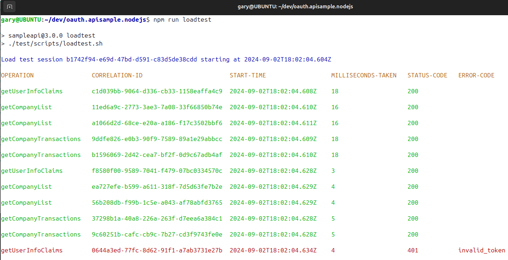
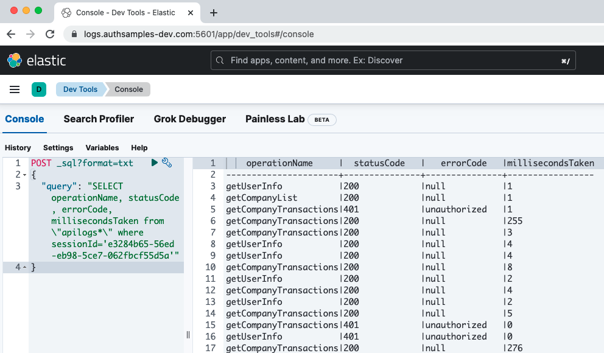

# Final OAuth Node.js API

[](https://www.codacy.com/gh/gary-archer/oauth.apisample.nodejs/dashboard?utm_source=github.com&amp;utm_medium=referral&amp;utm_content=gary-archer/oauth.apisample.nodejs&amp;utm_campaign=Badge_Grade) 

[](https://snyk.io/test/github/gary-archer/oauth.apisample.nodejs?targetFile=package.json)

## Behaviour

The final OAuth secured Node.js API code sample, referenced in my blog at https://authguidance.com:

* The API takes finer control over OAuth domain specific claims and uses a certified JOSE library
* The API uses JSON request logging and Elasticsearch log aggregation, for measurability
* The API uses constructoroinjection with request scoped ClaimsPrincipal / LogEntry objects

### API integrates with UI Clients

The API can run as part of an OAuth end-to-end setup, to serve my blog's UI code samples.\
Running the API in this manner forces it to be consumer focused to its clients:


### API can be Productively Tested

The API's clients are UIs, which get user level access tokens by running an OpenID Connect code flow.\
For productive test driven development, the API instead mocks the Authorization Server:


### API can be Load Tested

A basic load test uses promises to fire 5 parallel requests at a time at the API.\
This ensures no concurrency problems, and error rehearsal is used to verify that the API is supportable:



### API is Supportable

API logs can be analysed according using these [Technical Support Queries](https://authguidance.com/2019/08/02/intelligent-api-platform-analysis/):



## Commands

### Run the API

Ensure that Node.js 16+ is installed, then run the API with this command:

```bash
./start.sh
```

Then call an endpoint over port 446:

```bash
curl -k https://api.authsamples-dev.com:446/api/companies
```

### Configure DNS

Configure DNS by adding these domains to your hosts file:

```text
127.0.0.1 localhost api.authsamples-dev.com login.authsamples-dev.com web.authsamples-dev.com tokenhandler.authsamples-dev.com logs.authsamples-dev.com
```

### Test the API

Stop the API, then re-run it with a test configuration:

```bash
npm run testsetup
```

Then run integration tests and a load test:

```bash
npm test
npm run loadtest
```

### Run an SPA Client

Run these commands, then login to the SPA with credentials `guestuser@mycompany.com / GuestPassword1`:

```bash
cd ..
git clone https://github.com/gary-archer/oauth.websample.final
cd oauth.websample.final
./build.sh LOCALAPI && ./run.sh LOCALAPI
```

### Query API Logs

Deploy Elasticsearch with these commands, signing in to Kibana with credentials `elastic / Password1`:

```bash
cd ..
git clone https://github.com/gary-archer/logaggregation.elasticsearch
cd logaggregation.elasticsearch
./deployment/docker-local/deploy.sh
```

## Further Details

* See the [Overview Page](https://authguidance.com/2017/10/27/api-architecture-node) for further details on running the API in end-to-end setups
* See the [Coding Key Points Page](https://authguidance.com/2017/10/27/final-nodeapi-coding-key-points/) for key implementation details
* See the [Non Functional Behaviour](https://authguidance.com/2017/10/08/corporate-code-sample-core-behavior/) page for a summary of overall qualities

## Programming Languages

* Node.js with TypeScript is used to implement the REST API

## Infrastructure

* Express is used to host the API over SSL
* AWS Cognito is used as the default Authorization Server
* The [JOSE Library](https://github.com/panva/jose) is used to manage in memory validation of JWTs
* [Inversify](http://inversify.io) is used to manage dependencies in line with other development languages
* The API is designed for [Cloud Native Deployment](https://github.com/gary-archer/oauth.cloudnative.local) to Kubernetes
